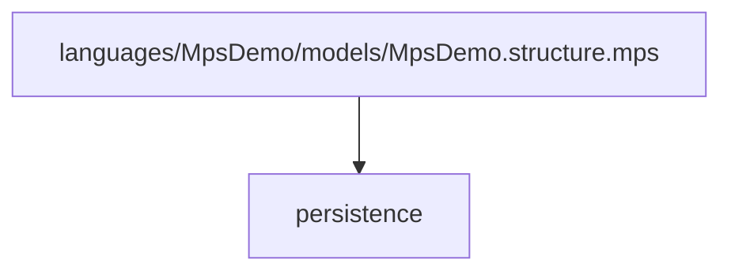
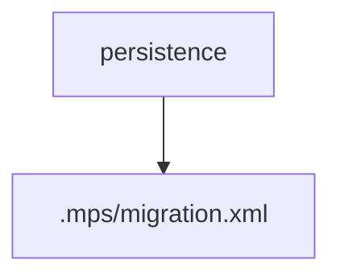

```mermaid
graph TD
     languages/MpsDemo/models/MpsDemo.structure.mps --> persistence

%% Swimm:
%% graph TD
%%      <SwmPath>[languages/MpsDemo/models/MpsDemo.structure.mps](/languages/MpsDemo/models/MpsDemo.structure.mps)</SwmPath> --> <SwmToken path="/languages/MpsDemo/models/MpsDemo.structure.mps" pos="3:2:2" line-data="  &lt;persistence version=&quot;9&quot; /&gt;">`persistence`</SwmToken>
```

```mermaid
graph TD
    persistence--> .mps/migration.xml 

%% Swimm:
%% graph TD
%%     <SwmToken path="/languages/MpsDemo/models/MpsDemo.structure.mps" pos="3:2:2" line-data="  &lt;persistence version=&quot;9&quot; /&gt;">`persistence`</SwmToken>--> <SwmPath>[.mps/migration.xml](/.mps/migration.xml)</SwmPath> 
```

<SwmMeta version="3.0.0" repo-id="Z2l0aHViJTNBJTNBbXBzLWRlbW8lM0ElM0FJZGl0WWVnZXJTd2ltbQ==" repo-name="mps-demo">Powered by [Swimm](https://app.swimm.io/)</SwmMeta>
